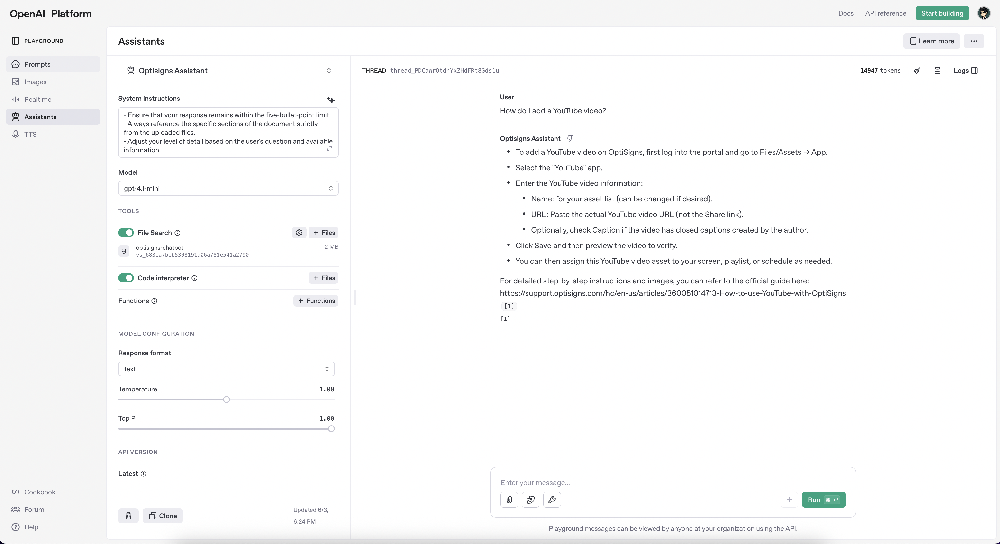

# OptiSigns Article Scraper & Vector Store Uploader

This project fetches articles from the OptiSigns support site, converts them to Markdown, detects new/updated articles, and uploads the delta to an OpenAI Vector Store.

## Setup

1.  **Clone the repository:**

    ```bash
    git clone <repository_url>
    cd <repository_directory>
    ```

2.  **Install dependencies (if running locally without Docker):**

    ```bash
    pip install -r requirements.txt
    ```

## Environment Variables

This project requires the following environment variables to be set:

-   `OPENAI_API_KEY`: Your OpenAI API key.
-   `ZENDESK_EMAIL`: The email address for your Zendesk account (used for basic authentication).
-   `ZENDESK_API_TOKEN`: Your Zendesk API token.
-   `ZENDESK_SUBDOMAIN`: The subdomain of your Zendesk help center (e.g., `optisigns`).

Create a `.env` file in the project root based on `.env.example` and provide your credentials:

```ini
OPENAI_API_KEY=sk-...your-key...
ZENDESK_EMAIL=your-email@example.com
ZENDESK_API_TOKEN=your-api-token
ZENDESK_SUBDOMAIN=your-subdomain
```

**Important:** Ensure your `.env` file is not committed to public repositories.

## Running with Docker

The recommended way to run this project is using Docker to ensure a consistent environment.

1.  **Build the Docker image:**

    ```bash
    docker build -t optisigns-bot .
    ```

2.  **Create a Docker Volume for Persistent Storage:**

    ```bash
    docker volume create optisigns-metadata-volume
    ```
    *(You only need to do this once)*.

3.  **Run the container, mounting the persistent volume and passing environment variables:**

    ```bash
    docker run \
        -e OPENAI_API_KEY=$OPENAI_API_KEY \
        -e ZENDESK_EMAIL=$ZENDESK_EMAIL \
        -e ZENDESK_API_TOKEN=$ZENDESK_API_TOKEN \
        -e ZENDESK_SUBDOMAIN=$ZENDESK_SUBDOMAIN \
        -v optisigns-metadata-volume:/app \
        optisigns-bot
    ```
    *(Replace `$OPENAI_API_KEY`, etc., with your actual keys/values, or use an `--env-file` as shown below)*.

    Alternatively, using your `.env` file:

    ```bash
    docker run --env-file .env -v optisigns-metadata-volume:/app optisigns-bot
    ```

    The `-v optisigns-metadata-volume:/app` part ensures that the `article_metadata.json` and `articles/` directories within the container persist between runs, allowing the delta logic to work.

## Running with Docker Compose

Docker Compose simplifies building and running the container, including managing the persistent storage.

1.  **Ensure your `.env` file is present with the required environment variables.**

2.  **Run Docker Compose:**

    ```bash
    docker-compose up --build
    # or with newer Docker: docker compose up --build
    ```

    This will build the image (if necessary), create/use the `optisigns-metadata-volume` (defined implicitly if not explicitly in docker-compose), and run the `optisigns-bot-container`.

## Link to daily job logs

```ini
http://164.92.100.157/log.txt
```

## Screenshot of Playground answer


